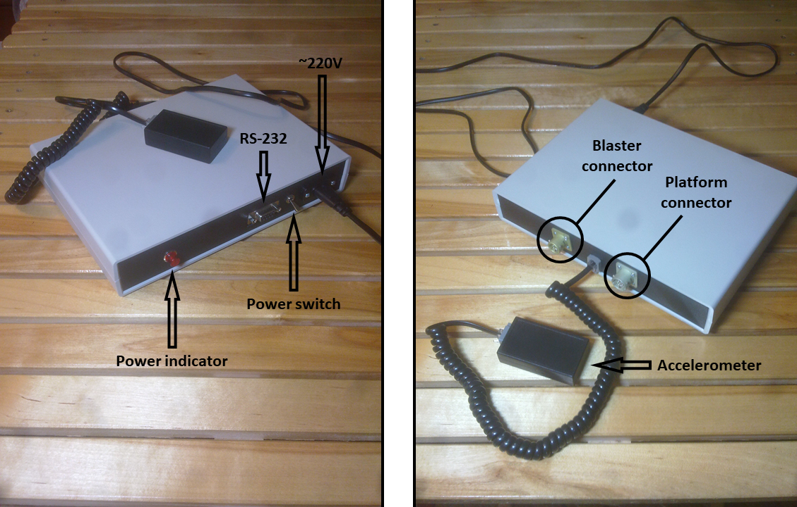
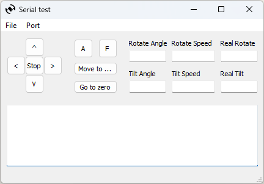

# Toy Gun Rotary Module

The goal is to create the device for remote aiming the Nerf N-Strike Mega Mastodon Blaster. 

## Overview
The toy gun is installed on a [LILIN PIH-303](https://www.meritlilin.com/en/product/PIH_303) pan/tilt platform. The platform is connected to the control module.  
The control module is based on [AVR-IO-M16](https://www.olimex.com/Products/AVR/Development/AVR-IO-M16/) development board.  
There is also an external accelerometer based on the [LSM303DLHC Board](https://www.waveshare.com/lsm303dlhc-board.htm).  
It can be optionally installed on the platform to enable automatic positioning to the starting point.  

## Repository Contents
* **firmware/** - Firmware sources for the module board
* **doc/** - General project documentation files
* **serial_test/** - An application for testing the remote control

## Interaction with the module
The module is controlled through RS-232 interface 9600/8/1/nopar/nohand. Each command is received and parsed by device. When a command is parsed an acknowledgement message is returned immediately.  
If the command has request for the status, the acknowledgement message is returned at first and then the status message.

### Commands
| Command          | Byte 0 | Byte 1 | Bytes 2:3    | Bytes 4:5  | Byte 6       | Byte 7     | Bytes 8:9 |
| ---------------- | ------ | ------ | ------------ | ---------- | ------------ | ---------- | --------- |
| Get status       | 0x21   | 0x00   | -            | -          | -            | -          | CRC16     |
| Go to position   | 0x21   | 0x01   | Angle rotate | Angle tilt | Speed rotate | Speed tilt | CRC16     |
| Stop             | 0x21   | 0x02   | -            | -          | DRIVE        | -          | CRC16     |
| Move             | 0x21   | 0x03   | -            | -          | DRIVE        | Speed      | CRC16     |
| Calibrate        | 0x21   | 0x04   | -            | -          | -            | -          | CRC16     |
| Fire             | 0x21   | 0x05   | -            | -          | -            | MODE       | CRC16     |

### Feedback
| Command          | Byte 0 | Byte 1 | Bytes 2:3    | Bytes 4:5  | Byte 6       | Byte 7             | Bytes 8:9 |
| ---------------- | ------ | ------ | ------------ | ---------- | ------------ | ------------------ | --------- |
| Acknowledge      | 0xA1   | 0xFF   | -            | -          | -            | -                  | CRC16     |
| Status           | 0xA1   | 0xFE   | Angle rotate | Angle tilt | Move status  | Calibration status | CRC16     |

#### Move status
| Bit 7               | Bit 6              | Bit 5      | Bit 4        | Bit 3       | Bit 2         | Bit 1         | Bit 0           |
| ------------------- | ------------------ | ---------- | ------------ | ----------- | ------------- | ------------- | --------------- |
| Accelerometer error | Accelerometer used | Tilt error | Rotate error | Tilt active | Rotate active | Tilt finished | Rotate finished |

#### Calibration status
| Bit 7 | Bit 6 | Bit 5 | Bit 4 | Bit 3 | Bit 2 | Bit 1                | Bit 0              |
| ----- | ----- | ----- | ----- | ----- | ----- | -------------------- | ------------------ |
| 0     | 0     | 0     | 0     | 0     | 0     | Calibration required | Calibration active |

### Go to position
Angle and speed values are in sign/magnitude notation 

### Stop/Move
Command require drive index (DRIVE)
* **Rotate** - 0x00
* **Tilt** - 0x01

### Fire
There is two modes of the fire, single and burst. Only one can be selected at the time. To select the mode, the corresponding bit must be set to `1`.  
To enable fire, `Enable` bit must be set to `1`.
 
#### Mode
| Bit 7 | Bit 6 | Bit 5 | Bit 4 | Bit 3 | Bit 2  | Bit 1  | Bit 0  |
| ----- | ----- | ----- | ----- | ----- | ------ | ------ | ------ |
| -     | -     | -     | -     | -     | Single | Burst  | Enable |

## Software

### Firmware
To build the firmware you need avr-gcc toolchain installed. I used [WinAVR](https://winavr.sourceforge.net/) when building in Windows.  
In the `firmware` folder simply run `make` in shell. The binary is `firmware/build/laz-head.hex` file.  
To load the firmware you need an ISP programmer and an [avrdude](https://www.nongnu.org/avrdude/) utility. I used simple USP ISP programmator.  
Then run `make prog` to load the firmware.

### Test Application
The application is written in Python and is based on PyQt5 framework. It requires [Python 3.8.10](https://www.python.org/downloads/release/python-3810/) distribution.  
Used [Qt 5.9.2](https://download.qt.io/archive/qt/5.9/5.9.2/) with MinGW toolchain.
In the `serial_test` folder run `make setup` to install some additional Python packages first.  
Run `make` to create files necessary for Python script.  
If you would like to make a single executable to run without any external libraries run `make distro` and check it out inside `service/dist` folder.  

